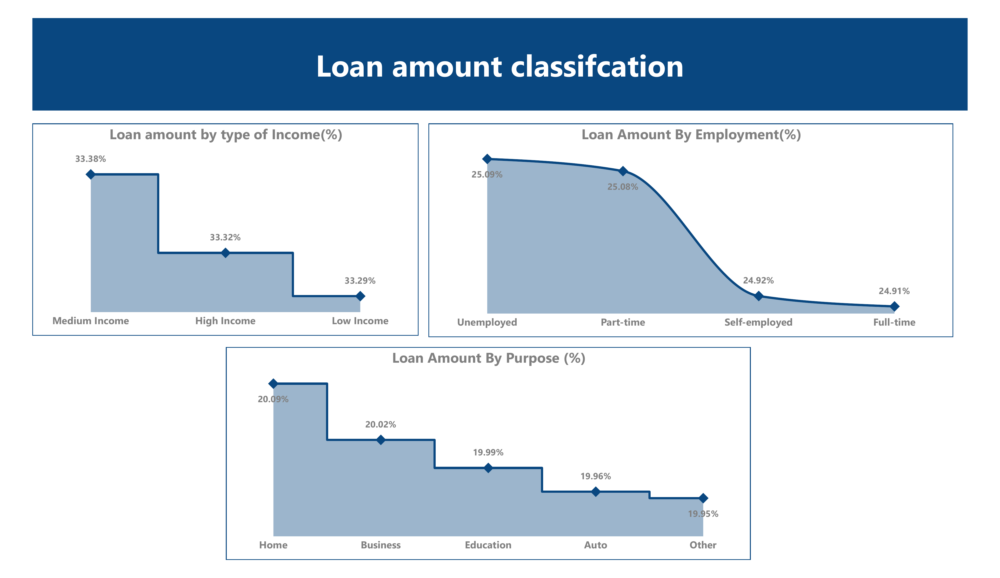
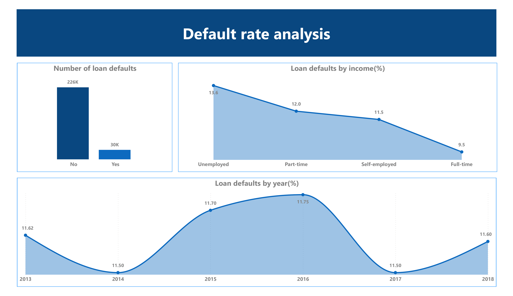
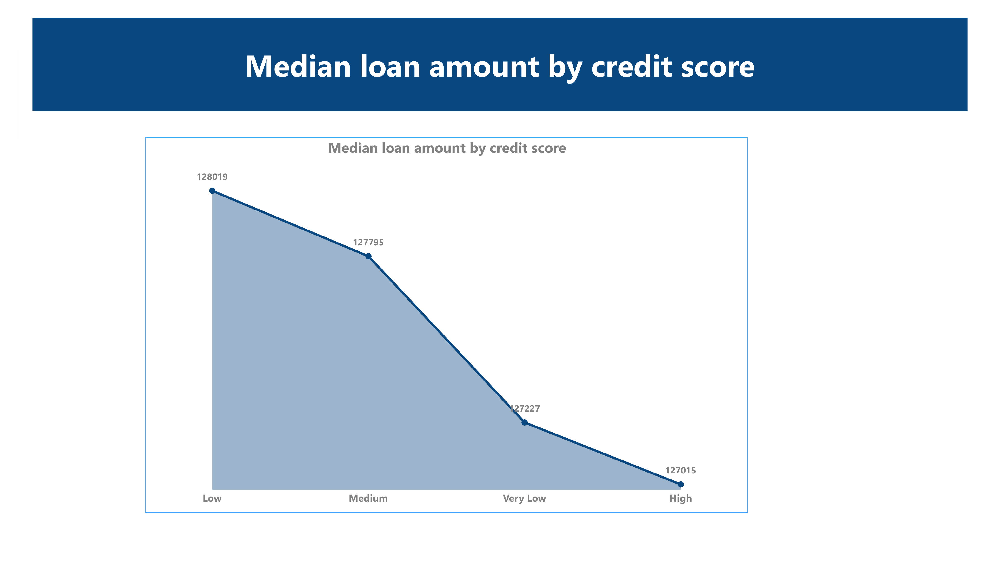

# Project 1: Loan Records Data Analysis

**Skills:** Python (Pandas, Matplotlib), SQL, Power BI, Data Cleaning, EDA  

## Overview
Analyzed 255,347 synthetic loan records to uncover borrower trends, credit score patterns, and default risk insights.  
Used Python for data preparation & feature engineering, and Power BI for interactive dashboards.

## Process
- **Data Preparation:** Cleaned dataset, formatted fields, removed duplicates.
- **Feature Engineering:** Added `IncomeCategory`, `ScoreCategory`, `LoanYear`.
- **EDA in Python:** Loan distribution, credit score analysis, loan trends over time.
- **Power BI Dashboard:** Loan classification, default rate analysis, borrower segmentation.

## Key Visuals

## Links
- 📓 [View Notebook](https://github.com/ian-obotey/Data-Analysis/blob/main/Projects/Loans/Notebook.ipynb)
- 📄 [Full Report (PDF)](loan-dataset-project.pdf)
- 📊 *Power BI Dashboard – Coming Soon*
